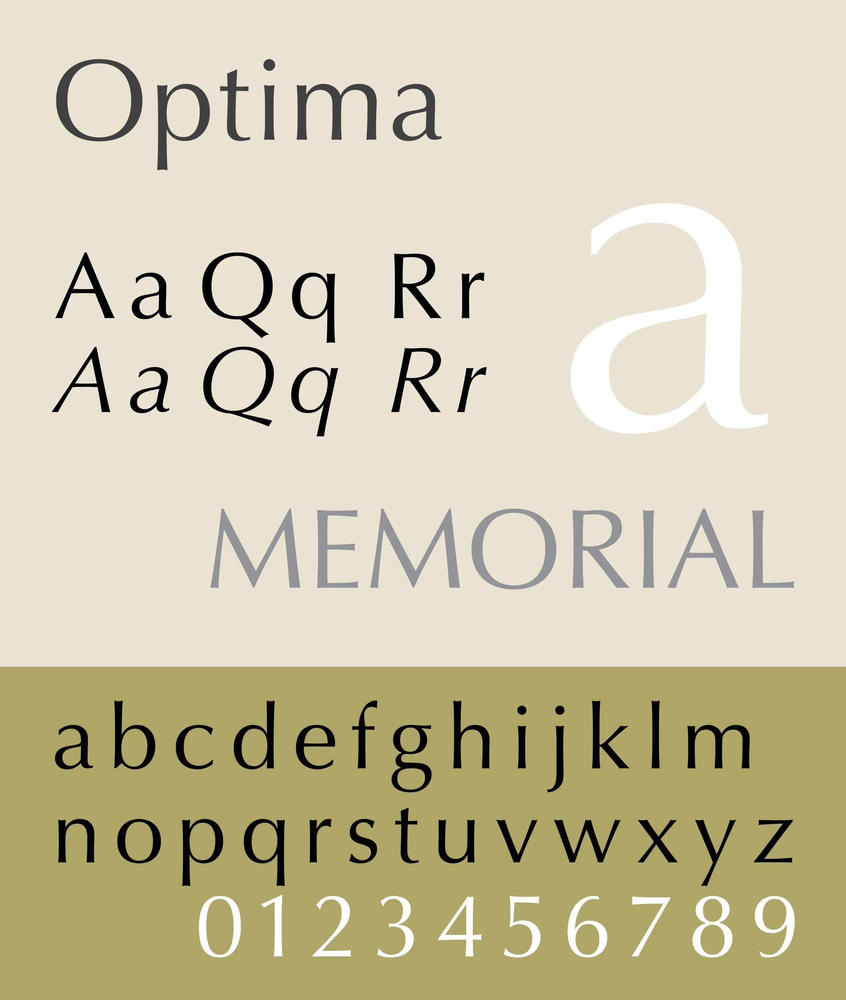

# Design Studie
> Material Design Studie für alle zu MDM gehörigen Mandanten :tada:

Die Studie zeigt die Einsatzmöglichkeit und Flexibilität von Material Design und Komponenten zur Schaffung ausdrucksstarker und einzigartiger Web-Anwendungen.

## Zweck
Wozu kann diese Studie dienen:
* Vorlage für Designs und Entwürfe
* Inspirationsquelle
* Diskussionsgrundlage
* Nachschlagewerk
* Dokumentation

## Design Grundlagen
Das auf Material Design basierende Konzept zielt darauf ab, ein markengerechtes, inhaltsorientiertes Erlebnis zu schaffen.

MDM Web-Anwendungen sind dazu in der Lage, eine Vielzahl von Themen abzudecken. Der Schwerpunkt liegt auf dem Shop und dessen Inhalt, insbesondere auf der Darstellung der Produkte und der dazu gehörigen Bilder.

Die Marke MDM ist so konzipiert, dass sie eine Vielzahl von Inhalten auf eine Weise anbietet, die den Inhalt selbst in den Vordergrund der Benutzererfahrung stellt. Das Branding wird durch das MDM-Logo, das typografische System und das Erscheinen der Primär- und Sekundärfarbe (Rot und Blau) in einer ansonsten in Graustufen gehaltenen App zum Ausdruck gebracht. Dieser subtile Ansatz stellt sicher, dass die Marke bemerkbar ist, wenn sie durch Farbe oder Typografie ausgedrückt wird.

### Inhaltlich fokussiert
Die Ästhetik von MDM Web-Anwendungen legt den Schwerpunkt auf den Inhalt, indem eine Graustufen-Farbpalette verwendet wird, um die Produktbilder hervorzuheben, und eine typografische Skala verwendet wird, die Überschriften fett und Produkttexte gut lesbar macht.

Das Layout-Raster der Anwendung ist von Katalogen inspiriert, um der ihr eine traditionelle, intuitive Struktur zu geben und gleichzeitig eine dichte Menge an Inhalten darstellen zu können.

## Produktarchitektur
Die Produktarchitektur von MDM Web-Anwendungen ist in einer Katalog-Struktur organisiert. Ein Katalog enthält kategorisierte, hierarchische Informationen, wobei die oberste Ebene aus Peers besteht, die untergeordnete Informationen enthalten können. Der Inhalt  ist in Hauptabschnitte und Unterabschnitte unterteilt, die denen eines Katalogs ähneln, wie z.B. Kollektionen, Neuheiten, Euro Münzen, International u.s.w.

Eine Katalog-Struktur ermöglicht es den Benutzern, schnell zu einem Interessengebiet zu navigieren. Dropdowns und Sidebar-Navigationen eignen sich ideal zum Navigieren durch eine Katalog-Struktur, weshalb die Anwendungen diese Komponenten verwenden.

### Navigation

### Branding Moment

### Suche

## Typografie

### Schriftarten
MDM Web-Anwendungen benutzen die Schriftarten Source Sans Pro und Optima.

### Schriftgrößen
Schriftgrößen basieren auf der [Material Design type specification](https://material.io/design/typography/the-type-system.html#type-scale)

#### Source Sans Pro
Source Sans Pro ist eine serifenlose Schriftart von Paul D. Hunt für Adobe und ist eine Interpretation und Erweiterung der Franklin Gothic. Obwohl die Franklin Gothic ursprünglich für die Verwendung als Displayschrift geschnitten wurde, ist sie auch in kleinen Größen gut lesbar. Ihre verschiedenen Gewichtungen machen es leicht, eine typografische Hierarchie aufzubauen.

_(Quelle: wikipedia.org)_

#### Optima
Optima  wurde als eine serifenlose Schriftart entworfen, die auf dem Bildschirm angenehm zu lesen ist. Sie zeichnet sich durch ihr ebenso filigranes wie klares Schriftbild aus und verkörpert die Verbindung zu Tradition und Beständigkeit der Marke MDM.

_(Quelle: wikipedia.org)_

## Ikonografie
MDM Web-Anwendungen verfolgt den Ansatz, erkennbare, funktionale Icons zu verwenden, die keine individuellen, unterscheidbaren Merkmale oder Verzierungen aufweisen. Dadurch, dass den Icons kein Branding oder eindeutiger Stil verliehen wird, können sie mit jedem beliebigen Inhalt in jedem beliebigen Ton gepaart werden und nicht mit dem Stil dieses Inhalts in Konflikt geraten.

Eine vollständige Liste der verfügbaren Icons [gibt es hier](https://materialdesignicons.com)

## Farben

#### Primärfarbe
Die Primärfarbe von MDM Web-Anwendungen ist Weiß. Sie verwendet eine Graustufen-Farbpalette, sodass die Produktbilder in den Shops hervorstechen und die Produkttexte ohne Ablenkung gut lesbar sind.

#### Sekundärfarbe
Die Sekundärfarbe ist Blau. Sie wird sparsam verwendet, um sicherzustellen, dass sie an den Orten, an denen sie erscheint, eine hohe Wirkung erzielt.

## Layout

### Grid System
MDM Web-Anwendungen kombinieren eine Vielzahl von Inhalten miteinander, insbesondere im Shop. Auf anderen Seiten, wie z.B. den Numismatik Informationsseiten, gibt es großzügigen Leerraum für den Inhalt. Alle Seiten verwenden dasselbe Responsive Grid System, sodass der Inhalt nach Erreichen bestimmter Breakpoints in den verfügbaren Bildschirmplatz zurückfließen kann und dadurch auf möglichst vielen Endgeräten ohne Einschränkungen verfügbar ist.  

Detaillierte Informationen zum Grid System, Abständen und Breakpoints in Material Design [gibt es hier](https://material.io/design/layout/responsive-layout-grid.html)

## Komponenten
Die UI-Komponenten basieren auf der [Vuetify Library](https://vuetifyjs.com/en/components/api-explorer)  
Eine detaillierte Betrachtung ist in Kürze [hier zu finden](./components.md).
