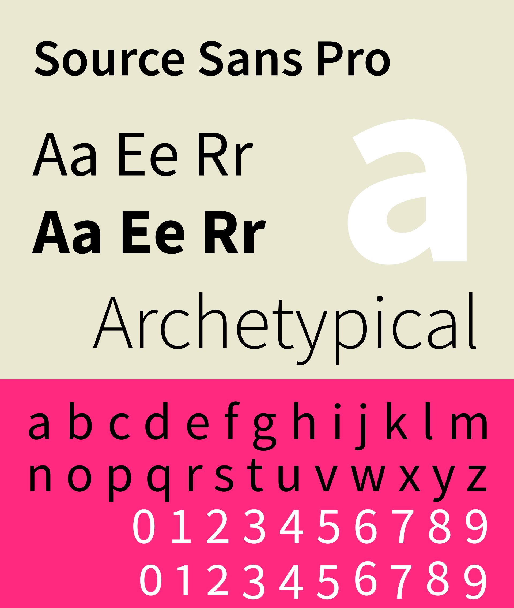

# Design Studie
> Material Design Studie für alle zu MDM gehörigen Mandanten :tada:

Die Studie zeigt die Einsatzmöglichkeit und Flexibilität von Material Design und Komponenten zur Schaffung ausdrucksstarker und einzigartiger Web-Anwendungen.

## Zweck
Wozu kann diese Studie dienen:
* Vorlage für Designs und Entwürfe
* Inspirationsquelle
* Diskussionsgrundlage
* Nachschlagewerk
* Dokumentation

## Design Grundlagen
Das auf Material Design basierende Konzept zielt darauf ab, ein markengerechtes, inhaltsorientiertes Erlebnis zu schaffen.

MDM Web-Anwendungen sind dazu in der Lage, eine Vielzahl von Themen abzudecken. Der Schwerpunkt liegt auf dem Shop und dessen Inhalt, insbesondere auf der Darstellung der Produkte und der dazu gehörigen Bilder.

Die Marke MDM ist so konzipiert, dass sie eine Vielzahl von Inhalten auf eine Weise anbietet, die den Inhalt selbst in den Vordergrund der Benutzererfahrung stellt. Das Branding wird durch das MDM-Logo, das typografische System und das Erscheinen der Primär- und Sekundärfarbe (Rot und Blau) in einer ansonsten in Graustufen gehaltenen App zum Ausdruck gebracht. Dieser subtile Ansatz stellt sicher, dass die Marke bemerkbar ist, wenn sie durch Farbe oder Typografie ausgedrückt wird.

### Inhaltlich fokussiert
Die Ästhetik von MDM Web-Anwendungen legt den Schwerpunkt auf den Inhalt, indem eine Graustufen-Farbpalette verwendet wird, um die Produktbilder hervorzuheben, und eine typografische Skala verwendet wird, die Überschriften fett und Produkttexte gut lesbar macht.

Das Layout-Raster der Anwendung ist von Katalogen inspiriert, um der ihr eine traditionelle, intuitive Struktur zu geben und gleichzeitig eine dichte Menge an Inhalten darstellen zu können.

## Produktarchitektur
Die Produktarchitektur von MDM Web-Anwendungen ist in einer Katalog-Struktur organisiert. Ein Katalog enthält kategorisierte, hierarchische Informationen, wobei die oberste Ebene aus Peers besteht, die untergeordnete Informationen enthalten können. Der Inhalt  ist in Hauptabschnitte und Unterabschnitte unterteilt, die denen eines Katalogs ähneln, wie z.B. Kollektionen, Neuheiten, Euro Münzen, International u.s.w.

Eine Katalog-Struktur ermöglicht es den Benutzern, schnell zu einem Interessengebiet zu navigieren. Dropdowns und Sidebar-Navigationen eignen sich ideal zum Navigieren durch eine Katalog-Struktur, weshalb die Anwendungen diese Komponenten verwenden.

### Navigation
Die Navigation ist das Herzstück der MDM Web-Anwendungen. Sie soll klar erkennbar sein und Nutzern jederzeit den Zugang zu jedem Bereich der Seite ermöglichen. Dabei muss die Benennung der Navigationspunkte auch von einem Laien klar verständlich sein. Ein weiterer wichtiger Aspekt ist die Anzahl der aufgeführten Hauptkategorien. Als Leitlinie gilt: 5-7 Punkte sind für das menschliche Auge gut zu scannen und können vom Gehirn gut verarbeitet werden. 
Gibt es Unterkategorien, können diese durch ein Submenü dargestellt werden, um tiefer in einen Bereich einzutauchen. Trotzdem sollte es möglich sein den Hauptnavigationspunkt auszuwählen und dann eine Übersichtsseite anzuzeigen, die alle Themen der Unterpunkte aufgreift, weil viele Nutzer mit der Anzahl und Funktion eines Submenüs überfordert sind. 

### Branding Moment
Das Branding soll sich konsistent durch alle Berührungspunkt mit der Marke durchziehen. (Print, E-Mail, Website). Dabei kann es sich um bestimmte Farben handeln, die überall gleich Anwendung finden, sowie die Einbindung des Logos. Einheitliches Wording über alle Web-Anwendungen hinweg ist ebenfalls ein wichtiger Aspekt bei der Unterstützung der Markenbildung.

Erfolgreiches Branding beinhaltet auch gute User Experience. Funktioniert die Webseite gut, werden Hilfestellungen gegeben und ist die Ansprache angenehm, dann ist es sehr wahrscheinlich, dass Nutzer das positive Erlebnis im Kopf behalten und wiederkommen.  
Das bezieht sich auch auf die Marketingmails nach einer Bestellung. Ist dort eine zu hohe werbliche Frequenz, sind die Nutzer genervt und fühlen sich verfolgt, was zu einer schlechten User Experience führt und einer hohen unsubscribe Rate.  
Kurz gesagt: die richtigen Inhalte zur richtigen Zeit in der richtigen Menge. 

### Suche
Eine ausführlichere Darstellung der Suche wird in Kürze [hier](./components.md) zu finden sein.

## Typografie
Durch Typografie kann ein Branding der Marke entstehen. Im Falle von MDM ist die Hausschrift im Logo die Optima. Diese wird in weiteren Bereichen der Webseite aufgegriffen, um einen Wiedererkennungseffekt zu haben. Dabei wird darauf zu geachtet, dass die Schrift auch auf kleinen Endgeräten gut lesbar ist (Laufweite, Serifen, etc.). Optima wird daher nur für Headlines verwendet. 

### Schriftarten
MDM Web-Anwendungen benutzen die Schriftarten Source Sans Pro und Optima.

#### Source Sans Pro
Source Sans Pro ist eine serifenlose Schriftart von Paul D. Hunt für Adobe und ist eine Interpretation und Erweiterung der Franklin Gothic. Obwohl die Franklin Gothic ursprünglich für die Verwendung als Displayschrift geschnitten wurde, ist sie auch in kleinen Größen gut lesbar. Ihre verschiedenen Gewichtungen machen es leicht, eine typografische Hierarchie aufzubauen.

_(Quelle: wikipedia.org)_

#### Optima
Optima  wurde als eine serifenlose Schriftart entworfen, die auf dem Bildschirm angenehm zu lesen ist. Sie zeichnet sich durch ihr ebenso filigranes wie klares Schriftbild aus und verkörpert die Verbindung zu Tradition und Beständigkeit der Marke MDM.

_(Quelle: wikipedia.org)_

### Schriftgrößen
Schriftgrößen basieren auf der [Material Design type specification](https://material.io/design/typography/the-type-system.html#type-scale)

## Ikonografie
MDM Web-Anwendungen verfolgt den Ansatz, erkennbare, funktionale Icons zu verwenden, die keine individuellen, unterscheidbaren Merkmale oder Verzierungen aufweisen. Dadurch, dass den Icons kein Branding oder eindeutiger Stil verliehen wird, können sie mit jedem beliebigen Inhalt in jedem beliebigen Ton gepaart werden und nicht mit dem Stil dieses Inhalts in Konflikt geraten.

Eine vollständige Liste der verfügbaren Icons [gibt es hier](https://materialdesignicons.com)

## Farben
Die maßgebliche Hintergrundfarbe von MDM Web-Anwendungen ist Weiß. Sie verwendet eine Graustufen-Farbpalette, sodass die Produktbilder in den Shops hervorstechen und die Produkttexte ohne Ablenkung gut lesbar sind.

#### Primäre Akzentfarbe
Die primäre Akzentfarbe von MDM Web-Anwendungen ist Rot. Sie wird sparsam verwendet, um sicherzustellen, dass sie an den Orten, an denen sie erscheint, eine hohe Wirkung erzielt, beispielsweise für die Primären Buttons `In den Warenkorb` oder `Kaufen`.

#### Sekundäre Akzentfarbe
Die sekundäre Akzentfarbe ist Blau und wird hauptsächlich für untergeordnete klickbare Elemente verwendet, wie z.B. den sekundären Button `Newsletter abonnieren`

#### Weitere Farben
Die weiteren Farben für beispielsweise Auszeichnungen, Erfolgs- und Fehlermeldungen orientieren sich an den Farbprinzipen von Material Design.

## Layout

### Grid System
MDM Web-Anwendungen kombinieren eine Vielzahl von Inhalten miteinander, insbesondere im Shop. Auf anderen Seiten, wie z.B. den Numismatik Informationsseiten, gibt es großzügigen Leerraum für den Inhalt. Alle Seiten verwenden dasselbe Responsive Grid System, sodass der Inhalt nach Erreichen bestimmter Breakpoints in den verfügbaren Bildschirmplatz zurückfließen kann und dadurch auf möglichst vielen Endgeräten ohne Einschränkungen verfügbar ist.  

Detaillierte Informationen zum Grid System, Abständen und Breakpoints in Material Design [gibt es hier](https://material.io/design/layout/responsive-layout-grid.html)

## Komponenten
Die UI-Komponenten basieren auf der [Vuetify Library](https://vuetifyjs.com/en/components/api-explorer)  
Eine detaillierte Betrachtung ist in Kürze [hier zu finden](./components.md).
